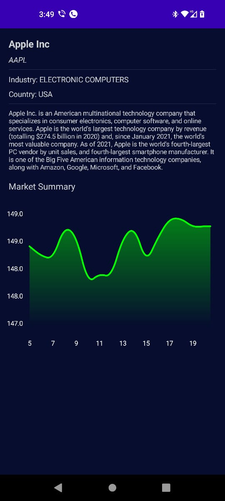

# StockMarket
A Stock Market App using all the lastest Android practices such as Jetpack Compose, Dagger Hilt, Kotlin Coroutines etc.

# How to implement?

1. Clone the repo or download the source code on your local machine.
2. Add the necessary dependencies.

# 📷 Screenshots

## Company List, Company Info Screem

    

## Company Info

    

## 🔥 Features
 - It usesAlphavantage free API to get Stock Market data
 - CSV Parser
 
  ## 🛠 Tech Used
 - Android
 - Kotlin programming language
 - Lottie Animations

## Contributing

Contributions are always welcome!

If you have any suggestions or any feedback please create an issue.

Please adhere to this project's `code of conduct`.
 
## Installation 

If anyone needs the apk please, create an issue. 
    
## Support

For support, email akshatrko@gmail.com .
